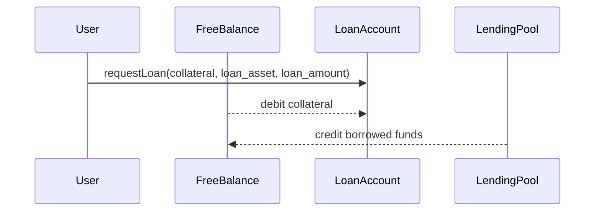
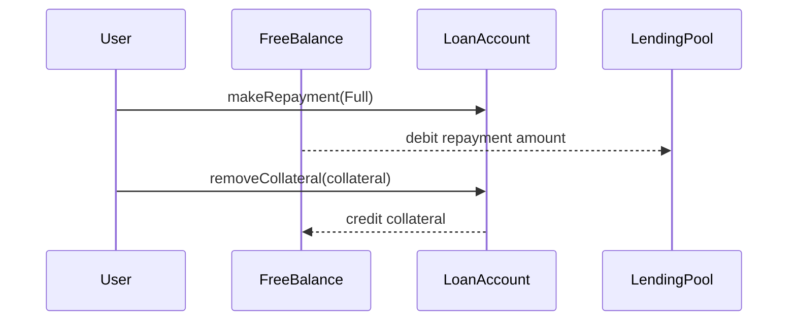
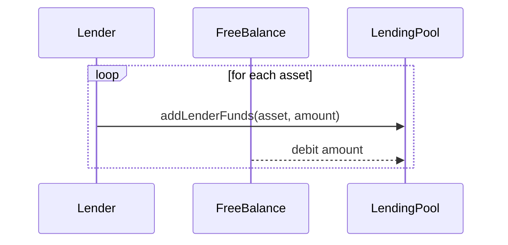
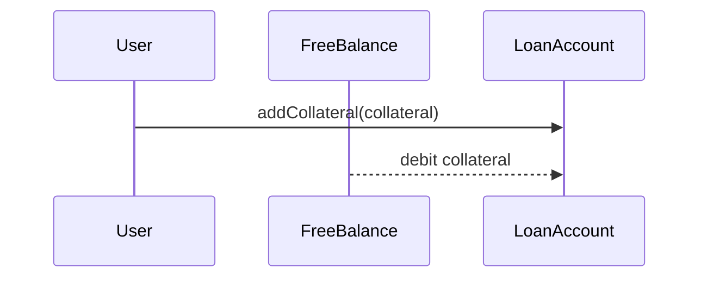
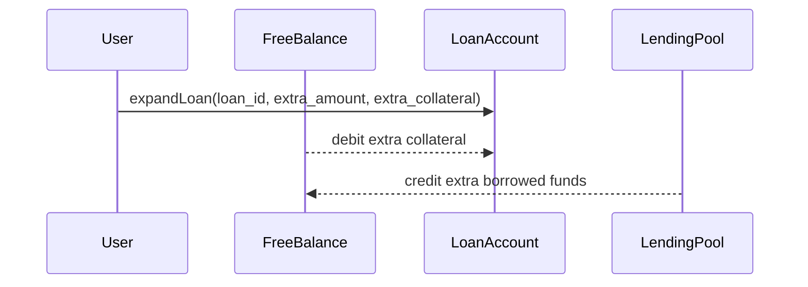
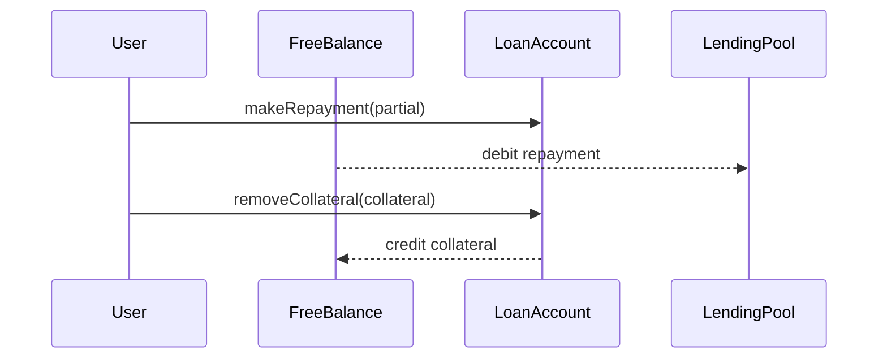
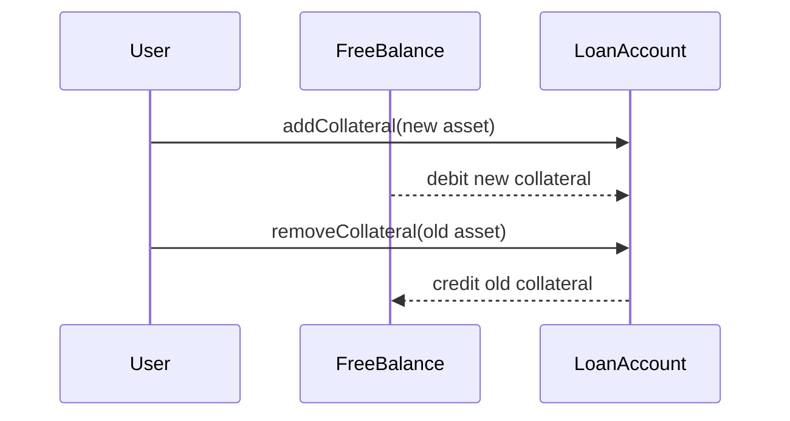
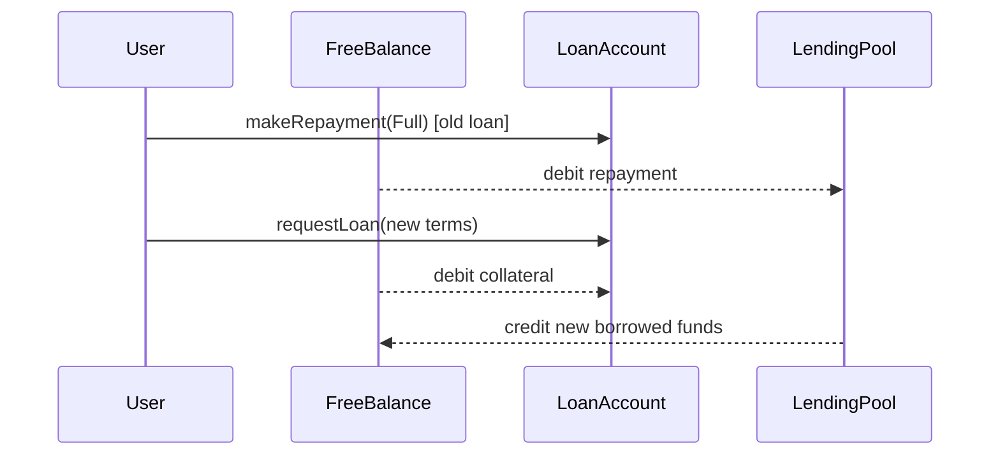

# Chainflip Lending SDK

TypeScript SDK for the Chainflip lending protocol. Wraps the lending RPC methods and extrinsics available on the Chainflip state chain.

## Install

```bash
npm install @chainflip/lending-sdk
```

## Usage

```ts
import { LendingClient } from "@chainflip/lending-sdk";

// Read-only queries (no ApiPromise needed)
const client = new LendingClient();
const pools = await client.getLendingPools();
const config = await client.getLendingConfig();

// With ApiPromise for submitting transactions
import { ApiPromise, WsProvider } from "@polkadot/api";
const api = await ApiPromise.create({ provider: new WsProvider("wss://mainnet-rpc.chainflip.io") });
const client = new LendingClient(undefined, api);

const tx = client.borrow({
  loan_asset: "Usdc",
  loan_amount: "0x1000",
  collateral: { Eth: "0x2000" },
});
await tx.signAndSend(account);
```

## Flow Sequence Diagrams

All flows operate through the account's **free balance** on the state chain. Collateral is debited from free balance; borrowed funds are credited to free balance.

### Borrow

Open a new loan. Collateral is taken from free balance, borrowed funds are credited to free balance.



### Repay & Close

Fully repay a loan and reclaim all collateral.



### Supply Multiple (Lender)

Lender deposits into one or more lending pools.



### Withdraw Supply (Lender)

Lender removes funds from lending pools back to free balance.


### Top Up Collateral

Add more collateral from free balance to avoid liquidation.



### Expand Loan

Borrow more against existing or additional collateral.



### Deleverage

Partial repayment and free up excess collateral.



### Swap Collateral

Replace one collateral type with another.



### Refinance

Close an existing loan and immediately open a new one with different terms.

